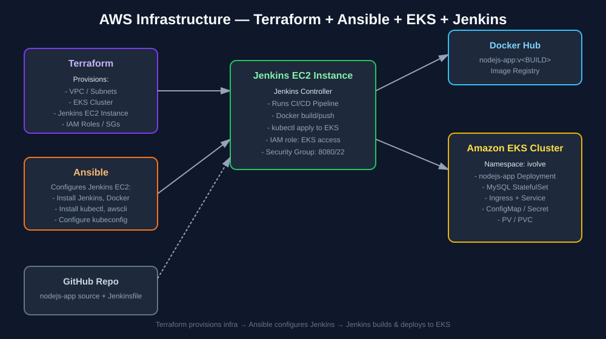
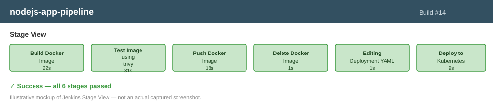

# Lab 22: Jenkins Pipeline for Application Deployment

## Context: Project Infrastructure

This lab builds a Jenkins CI/CD pipeline for the **nodejs-app** project, which runs on the following AWS infrastructure:
source code: https://github.com/moelkashef74/terraform-aws-eks-ansible-infra.git

- **Terraform** provisions the base AWS infrastructure:
  - VPC, subnets, security groups, and IAM roles
  - An **Amazon EKS cluster** that hosts the `ivolve` namespace (the `nodejs-app` Deployment, MySQL StatefulSet, Service, Ingress, ConfigMap/Secret, and PV/PVC from earlier labs)
  - An **EC2 instance** dedicated to Jenkins
- **Ansible** configures the Jenkins EC2 instance after Terraform provisions it:
  - Installs Jenkins, Docker, `kubectl`, and the AWS CLI
  - Adds the `jenkins` user to the `docker` group
  - Configures the `kubeconfig` so Jenkins can talk to the EKS cluster
  - Installs required Jenkins plugins
- **Jenkins** (running on the EC2 instance) hosts the pipeline in this lab, which builds, tests, containerizes, and deploys the Node.js app straight to the EKS cluster.

```text
Terraform  →  provisions VPC + EKS cluster + Jenkins EC2 instance
Ansible    →  configures the Jenkins EC2 instance (Jenkins, Docker, kubectl, awscli)
Jenkins    →  runs the CI/CD pipeline in this lab and deploys to the EKS cluster
```



> The diagram above is an illustrative architecture mockup describing the infrastructure layout — not a captured screenshot.

---

## Lab Requirements

- Create a pipeline that automates the following processes:
  1. Run Unit Test
  2. Build App
  3. Build Docker image from Dockerfile in GitHub
  4. Push image to Docker Hub
  5. Delete image locally
  6. Edit new image in `deployment.yaml` file
  7. Deploy to k8s cluster (EKS)
- Set pipeline post actions (`always`, `success`, `failure`)

---

# Requirements from Previous Labs

Before starting this lab, ensure the following resources already exist:

- A running **Amazon EKS cluster**, provisioned via Terraform, with the `ivolve` namespace and its `nodejs-app` Deployment, Service, ConfigMap, Secret, PV/PVC, and MySQL StatefulSet from Labs 11-16.
- A **Jenkins EC2 instance**, provisioned via Terraform and configured via Ansible, with:
  - Jenkins installed and running on port `8080`
  - Docker installed, with the `jenkins` user in the `docker` group
  - `kubectl` and AWS CLI installed and configured with a `kubeconfig` pointed at the EKS cluster
  - The following Jenkins plugins installed:
    - **Git**
    - **Docker Pipeline**
    - **Kubernetes CLI** (or `kubectl` available on the agent PATH)
    - **Pipeline: Stage View**
- Your Node.js application and database source code (with a `Dockerfile`, `package.json`, and test scripts) pushed to a GitHub repository.
- A `deployment.yaml` file (the same one from Lab 16) stored inside the GitHub repo, e.g. under `k8s/nodejs-deployment.yaml`, so the pipeline can edit and re-apply it.

Verify Ansible successfully configured the Jenkins EC2 instance:

```bash
ssh -i <your-key>.pem ec2-user@<jenkins-ec2-ip>
systemctl status jenkins
docker --version
kubectl get nodes
```

Output:

```text
● jenkins.service - LSB: Start Jenkins at boot time
   Loaded: loaded (/etc/init.d/jenkins; generated)
   Active: active (running) since Mon 2026-07-27 09:12:03 UTC
Docker version 24.0.7, build afdd53b
NAME                          STATUS   ROLES    AGE   VERSION
ip-10-0-1-21.ec2.internal     Ready    <none>   3h    v1.29.0
ip-10-0-1-45.ec2.internal     Ready    <none>   3h    v1.29.0
```

---

# Step 1: Add Jenkins Credentials

Go to **Manage Jenkins → Credentials → System → Global credentials**, and add:
 
| ID                | Kind                               | Purpose                                 |
|-------------------|------------------------------------|-----------------------------------------|
| `dockerhub-cred`  | Username with password             | Docker Hub login (push image)           |
| `github-cred`     | Username with password             | Clone the GitHub repo                   |
| `service-account-token` | Secret text                  | sa token for the EKS cluster            |


---

# Step 2: Create a New Pipeline Job

1. Open the Jenkins dashboard at `http://<jenkins-ec2-public-ip>:8080`.
2. Dashboard → **New Item**.
3. Enter name: `nodejs-app-pipeline`.
4. Select **Pipeline**, click **OK**.
5. Under **Pipeline** section, choose:
   - Definition: **Pipeline script from SCM**
   - SCM: **Git**
   - Repository URL: your GitHub repo URL
   - Credentials: `github-cred - dockerhub-cred - service-account-token`
   - Script Path: `CI-CD/lab22/Jenkinsfile`
6. Save.



> Illustrative mockup of the Jenkins **Stage View** once the job has run — not a captured screenshot. Each stage below corresponds to one box in this view.

---

# Step 3: Write the Jenkinsfile

Create a `Jenkinsfile` in the lab22 directory. 

```groovy
pipeline {
    agent any

    environment {
        IMAGE_NAME = 'mosayed711/nodejs-app'
        IMAGE_TAG = "v2.${BUILD_NUMBER}"
        CLUSTER_NAME = 'eks-test-cluster'
        AWS_REGION = 'us-east-1'
        APP_DEPLOYMENT = 'CI-CD/lab22/nodejs-app.yaml'
        CLUSTER_ENDPOINT = 'https://78709925DDB4ABF9A5C4CA18988D4296.gr7.us-east-1.eks.amazonaws.com'
    }

    stages {

        

        stage('Build Docker Image') {
            steps {
                sh '''
                echo "Building Docker image..."
                docker build -t $IMAGE_NAME:$IMAGE_TAG CI-CD/lab22/
                '''
            }
        }

        stage('Test Docker Image using trivy') {
            steps {
                sh 'echo "Testing Docker image using trivy..."'
                sh """
                trivy image \
                --cache-dir /tmp/trivy-cache \
                --timeout 10m \
                --scanners vuln \
                --severity HIGH,CRITICAL \
                $IMAGE_NAME:$IMAGE_TAG
                """
            }
        }

        stage('Push Docker Image') {
            steps {
                withCredentials([
                    usernamePassword(
                        credentialsId: 'dockerhub-credentials',
                        usernameVariable: 'DOCKER_USERNAME',
                        passwordVariable: 'DOCKER_PASSWORD'
                    )
                ]) {
                    sh '''
                    echo $DOCKER_PASSWORD | docker login \
                    -u $DOCKER_USERNAME \
                    --password-stdin

                    docker push $IMAGE_NAME:$IMAGE_TAG
                    '''
                }
            }
        }

        stage('Delete Docker Image') {
            steps {
                sh 'echo "Deleting Docker image..."'
                sh "docker rmi $IMAGE_NAME:$IMAGE_TAG"
            }
        }

        stage('Editing Deployment YAML') {
            steps {
                sh 'echo "Editing deployment YAML file..."'
                sh "sed -i 's|image: .*|image: $IMAGE_NAME:$IMAGE_TAG|' ${APP_DEPLOYMENT}"
            }
        }

        stage('Deploy to Kubernetes') {
            steps {
                withCredentials([
                    string(credentialsId: 'k8s-token', variable: 'K8S_TOKEN')
                ]) {
                    sh '''
                    echo "Deploying to Kubernetes..."

                    kubectl apply \
                    -f ${APP_DEPLOYMENT} \
                    --server=${CLUSTER_ENDPOINT} \
                    --token=${K8S_TOKEN} \
                    --insecure-skip-tls-verify=true
                    '''
                }
            }
        }
    }

    post {
        always {
            sh 'echo "pipeline completed."'
        }

        success {
            sh 'echo "pipeline completed successfully."'
        }

        failure {
            sh 'echo "pipeline failed."'
        }
    }
}
```

---

# Step 4: Run the Pipeline and Verify Each Stage

Go to the Jenkins job `nodejs-app-pipeline` and click **Build with Parameters**. The sections below walk through each stage with its command and expected console output.

    

---

# Step 5: Verify Post Actions

At the end of the run, Jenkins executes the `post` block:

```text
[Pipeline] // stage
[Pipeline] echo
Pipeline finished. Cleaning workspace...
[Pipeline] echo
Pipeline succeeded: nodejs-app deployed with image mosayed711/nodejs-app:v14
[Pipeline] End of Pipeline
Finished: SUCCESS
```

If a stage fails (e.g. a unit test fails), the `failure` block runs instead:

```text
[Pipeline] echo
Pipeline finished. Cleaning workspace...
[Pipeline] echo
Pipeline failed. Check the logs above for the failing stage.
[Pipeline] End of Pipeline
Finished: FAILURE
```

---

# Step 6: Verify the Deployment on EKS

Check that the new image was rolled out to the `nodejs-app` Deployment:

```bash
kubectl get deployment nodejs-app -n ivolve -oyaml | grep image
```

Output:

```text
image: mosayed711/nodejs-app:v14
```

Confirm the app is reachable
```bash
curl http://nodejs-app.ivolve.com:31373/
```

If everything is configured correctly, the pipeline will have run tests, built and pushed a new Docker image, updated the deployment manifest, and rolled out the new version to the `ivolve` namespace on your EKS cluster automatically — and you should see the **iVolve** web page.

---

